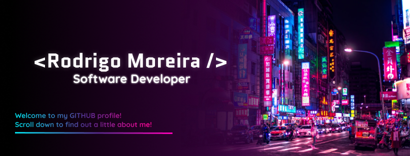

<h1 align="center"> <b> Hello World! </b> 👋🏽</h1>

  
  
  
  
  
  

My name is Rodrigo Moreira, I'm a full stack software developer, I'm certificated in computer technical course at Instituto Federal de São Paulo (IFSP). Besides being a programmer, I also do some design work using Figma. I'm a great technology enthusiast and I always look for improving my skills by developing applications that stimulate my creativity and allow me to overcome my limitations. 

I'm passionate about acquiring new knowledge and understanding how technologies work, so expanding my knowledge is something I never give up. As an extremely flexible professional, I'm always open to new challenges and opportunities.

  <b>Feel free to browse my profile 😉❤️</b>

  <quote>
    ❝The secret of success is constancy of purpose❞
  </quote>

****

 
  
 <h2>✨ A little bit about me </h2>
 🌎 | Brazilian 🇧🇷  
 🏫 | Student at IFSP 🧑🏾‍🎓  
 🎨 | studying UI/UX designer 🖼  
 💻 | I'm a Full Stack Developer 👨🏾‍💻  
 🎮 | A great lover of arts and readings 📚  
 💖 | A technology and development enthusiast 🔬  
 🧠 | A admirer of philosophy and social sciences 🤔 

## 🛠 Languages and Tools:

  
  
  
  
  
  
  
  
  
  
  
  
  
  
  
  
  
  
  
  
  
  

<h2 align="center"> 🎇 My github stats: 🎇</h2>

  
  

##

  

****
