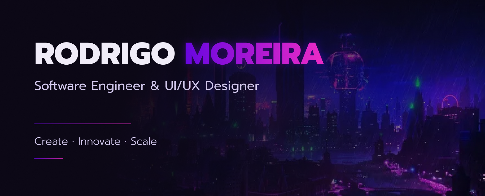

<h1 align="center"><b> Hello World! </b> 👋🏽😉</h3>

  
  
  
  
  

<h2>🤔 Who am I?</h2>

  I’m a Full Stack Software Engineer with over 4 years of professional experience, passionate about building innovative and creative solutions. I have a strong appreciation for solving complex and challenging problems, always aiming to turn ideas into reliable and impactful software.

As a Software Engineer, my goal is to design and develop scalable, high-performance applications that prioritize accessibility, usability, and responsiveness. I care deeply about writing clean, maintainable code and delivering solutions that create real value for users and businesses.

As a technology enthusiast, I’m constantly seeking to expand my knowledge and skill set, staying up to date with modern tools, best practices, and architectural patterns. I believe continuous learning is essential to building increasingly effective and meaningful solutions.

****

 
  
 <h2>✨ A little bit about me </h2>

  🌎 | Brazilian Full Stack Engineer 👨🏾‍💻 🇧🇷 
  🛠 | Focused on scalable and maintainable solutions 
  🏗 | Interested in software architecture and system design 
  🎯 | User-centered and accessibility-minded   
  🧩 | Strong problem-solver who enjoys complex challenges   
  📚 | Lifelong learner and technology enthusiast  
  🤝 | Collaborative, curious and proactive 
  🌱 | Growth-oriented and open to new challenges 
  🎨 | Inspired by art, philosophy and social sciences   

## 🛠 Languages and Tools:

  
  
  
  
  
  
  
  
  
  
  
  
  
  
  
  
  
  
  
  
  
  
  

<h2 align="center"> 🎇 My github stats: 🎇</h2>

  
  

##

  

****
